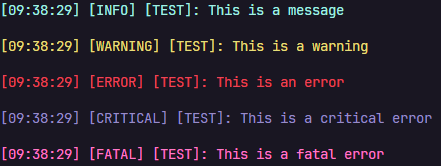

# Pandalog

Pandalog is a simple, easy-to-use logging library for Python. It provides a straightforward way to log messages, exceptions, and more with various levels of severity.

## Installation

You can install Pandalog from PyPI:

```bash
pip install pandalog
```

## Usage

Here's a basic example of how to use Pandalog:

```python
from pandalog import logger

logger.logInfo("This is a message", "TEST")
logger.logWarning("This is a warning", "TEST")
logger.logError("This is an error", "TEST")
logger.logCritical("This is a critical error", "TEST")
logger.logFatal("This is a fatal error", "TEST")
```

Output:



## Features

- Log messages with different levels of severity (INFO, WARNING, ERROR, etc.)
- Log exceptions with their stack traces
- Configurable log format
- Save logs to a file

## Contributing

Contributions are welcome! Please feel free to submit a Pull Request.

## License

Pandalog is licensed under the MIT License. See the `LICENSE` file for more details.
